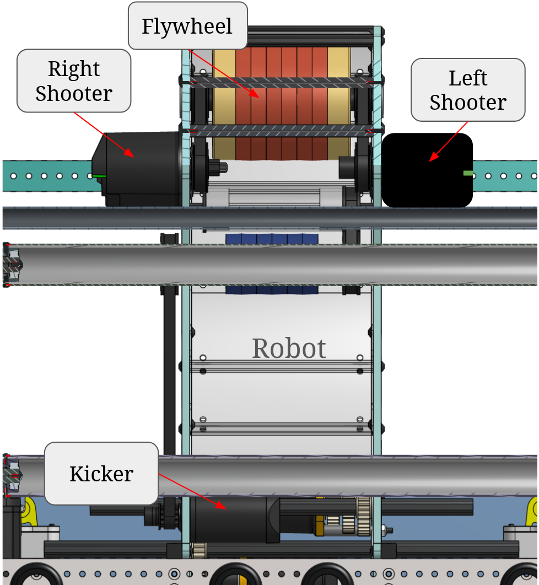

NOTE: The motor names ("Right" and "Left") appear inverted because are assigned with respect to robot forward direction, since the diagram depicts the robot facing the camera.
## Motors
* Right & Left Shooter Motors.
  * Spin the brass flywheels to launch the fuel.
* Kicker Motor.
  * Pushes the fuel (which is passed through the vectoring motors, in hopper) up to the shooter flywheels.
